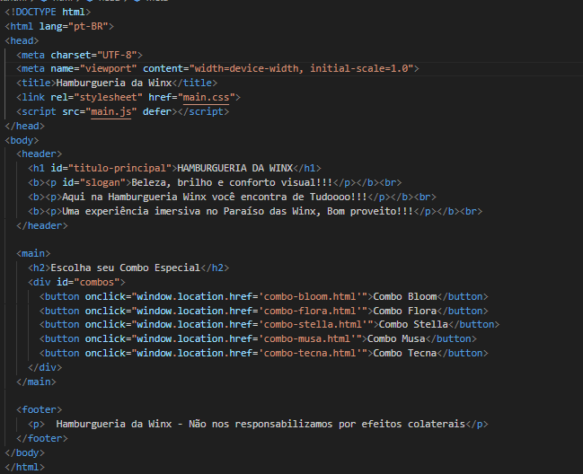
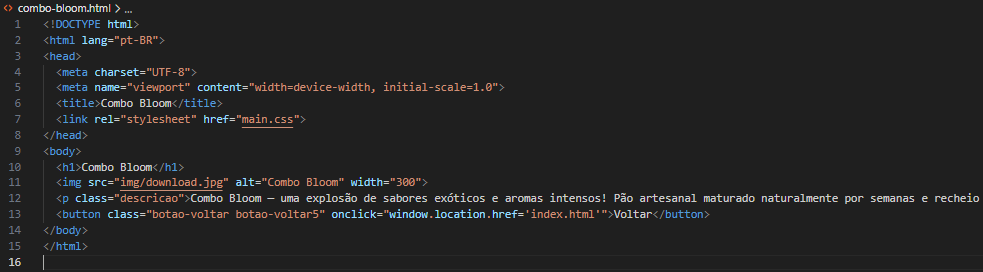
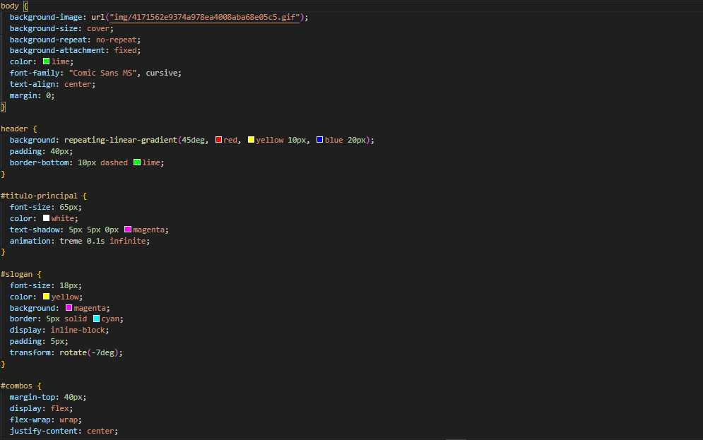
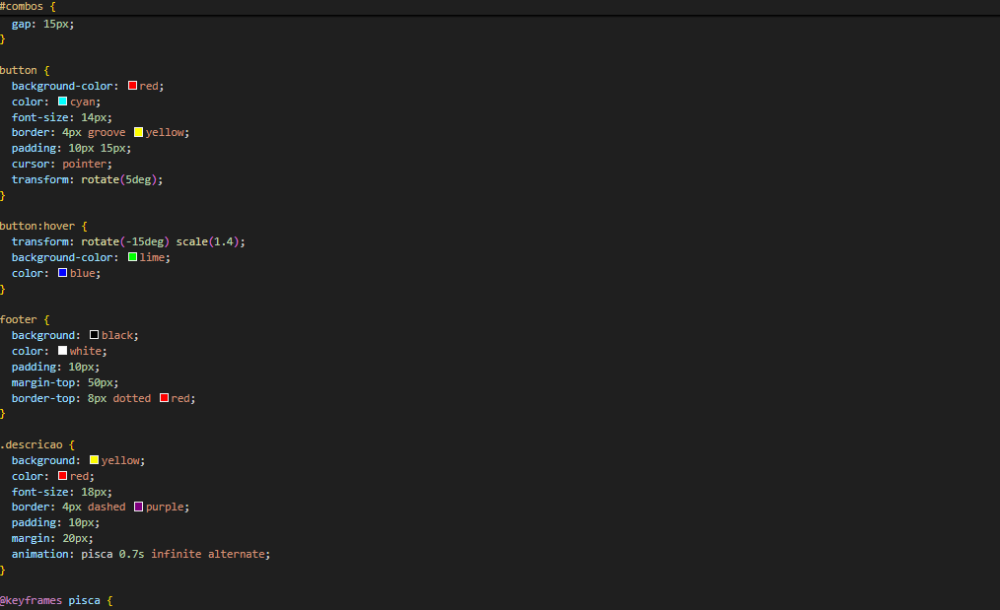
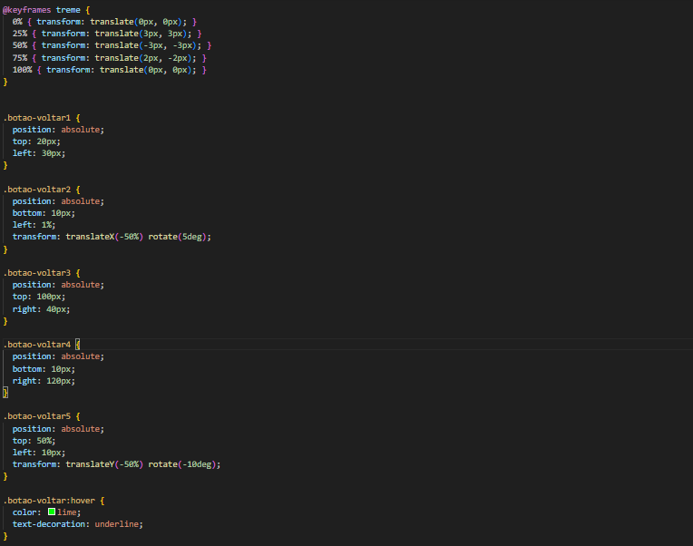
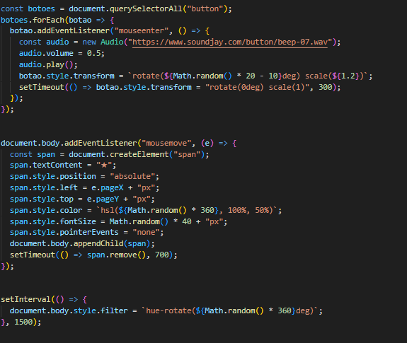

# Hamburgueria da Winx

## Sobre o projeto  

A **Hamburgueria da Winx** é um site propositalmente mal elaborado, desenvolvido para a atividade **"A pior página do mundo"**, na disciplina de **Web Design** & **Programação Web**
O objetivo é criar uma página temática com aparência desorganizada, cores conflitantes e layout confuso, mas que ainda mantenha as funcionalidades básicas de um site.

O tema escolhido foi inspirado no universo das fadas Winx, utilizando cores vibrantes, efeitos exagerados e elementos visuais intencionalmente destoantes.

---

## Estrutura do projeto  
O site é composto pelos seguintes arquivos:

- **index.html** — Página inicial com o título principal, imagem de fundo e botões de navegação.  
  

O arquivo index.html é a página principal do site Hamburgueria da Winx.
Ele começa com a declaração <!DOCTYPE html> e define o idioma da página como português do Brasil (lang="pt-BR").

No <head>, estão incluídos:

As meta tags de codificação (UTF-8) e de responsividade (viewport);

O título da página: “Hamburgueria da Winx”;

O link de referência para o arquivo de estilo main.css;

O script main.js, que é carregado de forma assíncrona com o atributo defer.

No <body>, há três seções principais:

1. <header>

Contém:

O título principal (<h1 id="titulo-principal">HAMBURGUERIA DA WINX</h1>);

Um slogan (
Beleza, brilho e conforto visual!!!
);

Dois parágrafos adicionais com mensagens temáticas sobre a hamburgueria.

2. <main>

Inclui:

Um subtítulo (<h2>Escolha seu Combo Especial</h2>);

Uma 
 com cinco botões, cada um levando a uma página diferente:

combo-bloom.html → Combo Bloom

combo-flora.html → Combo Flora

combo-stella.html → Combo Stella

combo-musa.html → Combo Musa

combo-tecna.html → Combo Tecna

Cada botão usa o atributo onclick com window.location.href para redirecionar o usuário à página correspondente.

3. <footer>

Contém uma frase humorística: “Hamburgueria da Winx - Não nos responsabilizamos por efeitos colaterais.”

- **combo.html** — Página onde mostra a descrição do lanche de forma detalhada.
  

O arquivo combo-bloom.html representa a página específica do Combo Bloom dentro do site Hamburgueria da Winx.
Ele segue a estrutura básica de um documento HTML5 e utiliza o mesmo arquivo de estilo principal (main.css).

🔹 <head>

Inclui:

A declaração de codificação UTF-8;

A meta tag de responsividade para ajustar o layout em dispositivos móveis;

O título da página: “Combo Bloom”;

A importação do arquivo CSS principal (main.css).

🔹 <body>

Contém os seguintes elementos:

Um título principal (<h1>Combo Bloom</h1>), indicando o nome do combo;

Uma imagem () com o arquivo img/download.jpg, exibida em tamanho de 300 pixels de largura, representando o combo;

Um parágrafo com a classe descricao, trazendo um texto temático e humorístico sobre o combo:

“Combo Bloom — uma explosão de sabores exóticos e aromas intensos! Pão artesanal maturado naturalmente por semanas e recheio com textura surpreendente. Uma experiência gastronômica única (e irreversível)!”

Um botão com as classes botao-voltar e botao-voltar5, que redireciona o usuário de volta à página principal (index.html) ao ser clicado.
- **main.css** — Arquivo de estilização com cores fortes, fontes grandes e elementos propositalmente desorganizados.  

  

Nessa primeira parte do arquivo **main.css**, contém toda a estilização visual da Hamburgueria da Winx.
O estilo é propositalmente exagerado e colorido, com animações, gradientes e combinações caóticas de cores, seguindo a proposta do projeto “A Pior Página do Mundo”.

🔹 Estilo geral do body

Define o fundo da página com:

Um GIF animado localizado em img/4171562e9374a978ea4008aba68e05c5.gif;

Configurações para cobrir toda a tela (background-size: cover) e fixar o fundo (background-attachment: fixed);

Cor principal do texto em verde-limão (color: lime);

Fonte Comic Sans MS em estilo cursivo;

Alinhamento centralizado e margem zerada.

🔹 header

Aplica:

Um fundo com degradê linear repetido em vermelho, amarelo e azul, com padrão diagonal de 45 graus;

Espaçamento interno de 40px (padding: 40px);

Uma borda inferior tracejada em verde-limão (border-bottom: 10px dashed lime).

🔹 #titulo-principal

Estiliza o título principal com:

Tamanho de fonte grande (65px);

Cor branca;

Sombra de texto magenta destacada (text-shadow: 5px 5px 0px magenta);

Uma animação chamada “treme”, que faz o texto vibrar rapidamente.

🔹 #slogan

Define o slogan com:

Fonte de 18px em cor amarela;

Fundo magenta e borda ciano de 5px sólida;

Exibição como bloco inline (display: inline-block);

Pequeno espaçamento interno (padding: 5px);

Efeito de rotação levemente inclinada (transform: rotate(-7deg)), reforçando o visual bagunçado.

🔹 #combos

Configura a seção dos botões dos combos com:

Margem superior de 40px (margin-top: 40px);

Uso de flexbox com quebra automática de linha (flex-wrap: wrap);

E alinhamento centralizado (justify-content: center).

  

Já nessa segunda parte do **main.css**
#combos

Define o espaçamento entre os botões com:

Gap de 15px, criando um pequeno espaço entre cada botão de combo.

🔹 **button**

Cria o estilo principal dos botões:

Fundo vermelho intenso;

Texto na cor ciano;

Fonte de 14px;

Borda groove amarela de 4px (um efeito tridimensional);

Espaçamento interno de 10px 15px;

Cursor muda para mãozinha ao passar o mouse (cursor: pointer);

Efeito de rotação de 5 graus para dar aparência torta e divertida.

🔹 **button:hover**

Quando o usuário passa o mouse sobre o botão:

O botão gira -15 graus e aumenta de tamanho (scale 1.4);

O fundo muda para verde-limão;

O texto muda para azul, criando contraste vibrante e propositalmente exagerado.

🔹 **footer**

Define o rodapé com:

Fundo preto e texto branco;

Espaçamento interno de 10px;

Margem superior de 50px;

E uma borda superior pontilhada vermelha de 8px, mantendo o visual caótico da página.

🔹 **.descricao**

Estiliza o texto de descrição com:

Fundo amarelo e texto vermelho;

Fonte de 18px;

Borda roxa tracejada de 4px;

Espaçamento interno (padding: 10px) e margem (margin: 20px);

Animação chamada “pisca”, que faz o texto alternar visibilidade a cada 0.7s, criando um efeito piscante contínuo.

  

E nessa última parte do **main.css**

@keyframes treme

Define uma animação de tremor constante nos elementos:

O elemento se move rapidamente em várias direções (translate para cima, baixo, esquerda e direita);

Isso cria o efeito de “tremedeira” contínua — um toque propositalmente caótico e engraçado, típico do estilo da Pior Página do Mundo.

🔹 **.botao-voltar1**

Posição absoluta no topo esquerdo da tela (top: 20px; left: 30px);

Serve como um dos botões de navegação (ex: “Voltar”);

Fixado no layout, independente da rolagem da página.

🔹 **.botao-voltar2**

Posição absoluta no canto inferior esquerdo (bottom: 10px; left: 1%);

Possui rotação de 5 graus, reforçando o visual desalinhado e divertido.

🔹 **.botao-voltar3**

Posição absoluta no canto superior direito (top: 100px; right: 40px);

Complementa o conjunto de botões espalhados pela tela, criando um layout propositalmente desorganizado.

🔹 **.botao-voltar4**

Posição absoluta no canto inferior direito (bottom: 10px; right: 120px);

Mantém o padrão de posicionamento fora do convencional, simulando uma página “caótica”.

🔹 **.botao-voltar5**

Centralizado verticalmente (top: 50%) e levemente deslocado para a esquerda (left: 10px);

Aplica uma rotação de -10 graus, reforçando o tema “bagunçado” e estilizado da página.

🔹 **.botao-voltar:hover**

Ao passar o mouse, o texto muda para verde-limão e ganha sublinhado;

Reforça a interatividade visual, mantendo o toque colorido e exagerado.

- **main.js** — Arquivo JavaScript responsável pelas interações e mensagens de alerta.
 

Script principal **(main.js)**

Este script é responsável por criar os efeitos visuais e interativos da página Hamburgueria da Winx.
Ele utiliza JavaScript para gerar uma experiência propositalmente caótica e exagerada, alinhada ao conceito de “A pior página do mundo”.

Funcionalidades principais:

Cursor personalizado: altera o ponteiro do mouse para um cursor colorido, reforçando o estilo visual chamativo e desorganizado da página.

Mensagem de boas-vindas: exibe um alerta após alguns segundos, introduzindo o visitante à experiência cômica e confusa do site.

Mensagens flutuantes aleatórias: a cada poucos segundos, surgem caixas de texto em posições aleatórias na tela, escritas em Comic Sans e com cores vibrantes.

As mensagens contêm frases humorísticas relacionadas ao tema da hamburgueria.

Cada uma aparece por um curto período e desaparece, sendo substituída por novas mensagens.

**Objetivo:**
O objetivo do código é criar uma atmosfera propositalmente desorganizada e divertida, representando um site “mal feito”, porém criativo.
O script faz parte da atividade “A Pior Página do Mundo”, desenvolvida em HTML, CSS e JavaScript para a disciplina de Web Design.

 

**Efeitos interativos (main.js - parte 2)**

Este trecho do código adiciona interações sonoras, visuais e dinâmicas à página, reforçando o caráter exagerado e propositalmente desorganizado do site Hamburgueria da Winx.
Ele utiliza recursos de JavaScript para gerar animações, sons e efeitos de cor em tempo real.

Funcionalidades principais:

Som nos botões: ao passar o cursor sobre qualquer botão, é reproduzido um som curto de “beep”, acompanhado de uma leve rotação e aumento no tamanho do botão.

O efeito retorna ao normal após alguns instantes, criando uma sensação de movimento constante e imprevisível.

Trilha de estrelas coloridas: enquanto o usuário move o mouse pela tela, pequenas estrelas coloridas são geradas nas posições correspondentes ao movimento.

As estrelas mudam de cor aleatoriamente e desaparecem após poucos milissegundos, criando um efeito visual vibrante e caótico.

Rotação de tonalidade da página: a cada 1,5 segundos, toda a página muda de cor através de um efeito de rotação de matiz (hue-rotate).

Esse efeito faz com que as cores do site mudem constantemente, intensificando o visual propositalmente confuso e chamativo.

Objetivo:

O código busca intensificar a estética caótica da Hamburgueria da Winx, combinando som, cor e movimento para reforçar a proposta da atividade “A Pior Página do Mundo”.
A intenção é criar uma experiência visualmente desordenada, porém criativa e coerente com o tema do projeto desenvolvido em HTML, CSS e JavaScript.
---

## Tecnologias utilizadas  
- HTML5  
- CSS3  
- JavaScript  

---

## Objetivo da atividade  
O objetivo desta atividade é desenvolver uma página com aparência propositalmente ruim, aplicando conceitos de design negativo e análise crítica.  
O site deve:
- Apresentar visual propositalmente desorganizado.  
- Manter as funcionalidades básicas de um site.  
- Seguir um tema definido, neste caso, o universo Winx.  

---

## Autor  
**Willian Almeida (Will)**  
Disciplina: Web Design & Programação Web
Instituição: [Marista Escola Social Irmão Ácacio]  
Cidade: Londrina - PR  

---

## Execução  
1. Faça o download de todos os arquivos do projeto.  
2. Abra o arquivo **index.html** em um navegador web.  
3. Explore o site e observe as características de design intencionalmente inadequadas.

---

## Referências: [Alura, como fazer um Readme! ](https://www.alura.com.br/artigos/escrever-bom-readme?srsltid=AfmBOooSQ4taFQYOTUI4v37Ci-ka5vNNAJVpW7ZBPAygZWxI8jsJGp2E) 

